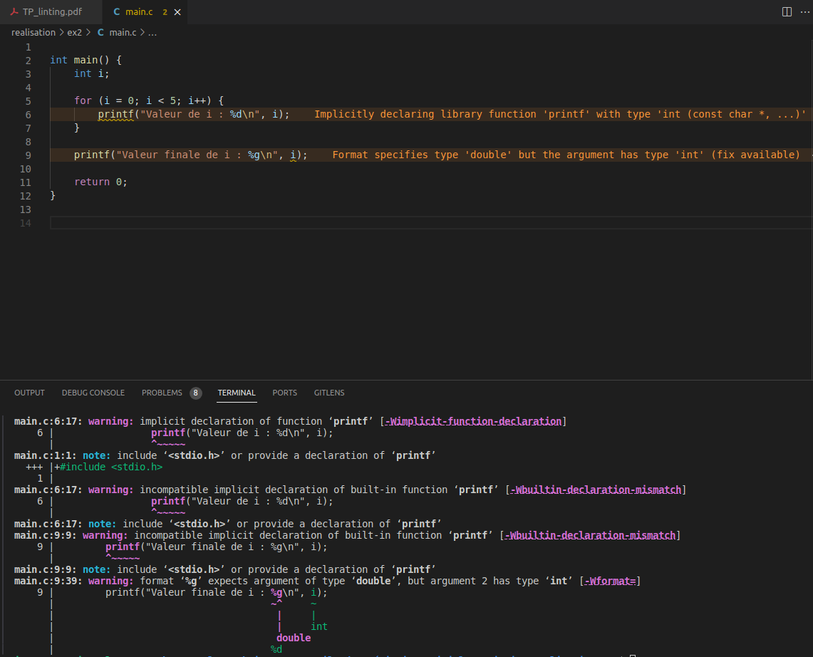
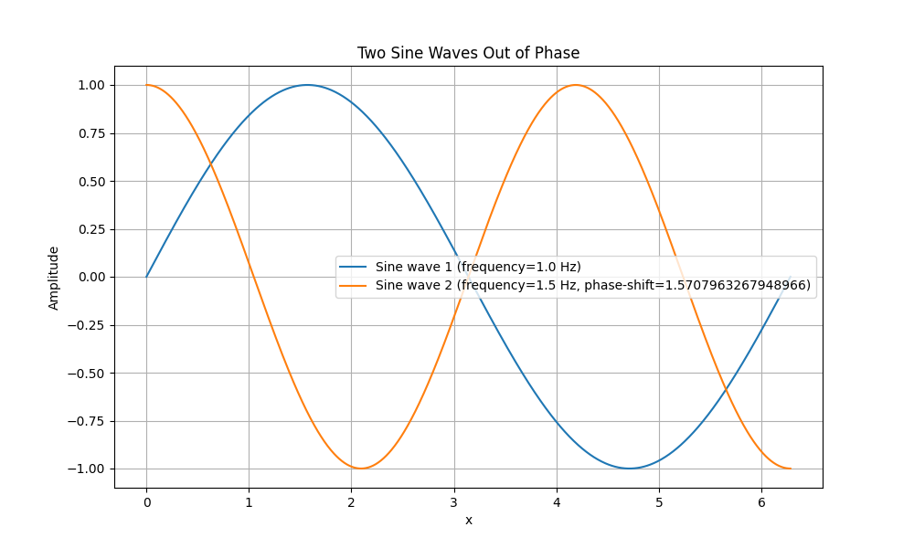
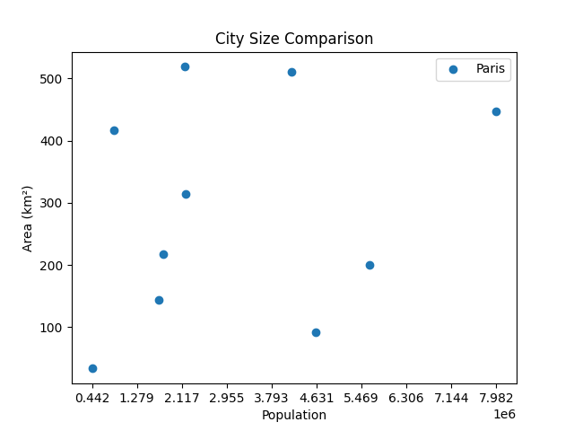

# Rapport - Julian

## # TP 4 : Linting & LLMs

### <u> Exercice 1 </u>

* **Ligne 6 :** Ce n'est pas vraiment une erreur, mais la variable `X` n'est pas définie. Il faut la définir si on veut l'utiliser.

* **Ligne 10 :** La commande `echo` est mal écrite.

* **Ligne 14 :** La première erreur que le *shellcheck* renvoie est que la syntaxe du `if` n'est pas bonne. Il y a un `;` au lieu d'un `]` dans le  `if`.

* **Ligne 14 :** La variable `num` n'est pas définie, il faut la définir.

* **Ligne 14 :** `shellcheck` dit que le `then` doit être séparé de `if` en rajoutant un `;` ou en allant à la ligne.

* **Ligne 21 :** Il y a un quote `'` au lieu d'un guillemet `"`.

* **Ligne 25 :** Il manquait un `$` devant la parenthèse ouvrante.

* **Ligne 27 :** Il manquait un `"` à la fin du `echo`.

* **Ligne 33 :** Il faut remplacer les `'` par des `"`. 

#### &emsp; 1)
La correction se trouve dans `./ex1/tofix.sh`.

### <u> Exercice 2 </u>

#### &emsp; 1)
Le programme ne compile pas.

#### &emsp; 2)
On voit bien les warnings dans l'IDE et dans la sortie du compilateur.  

#### &emsp; 3)

##### &emsp;&emsp;&emsp; b)

* **Ligne 6 & 9 :** `printf` ne marche pas car la bibliothèque `stdio.h` n'a pas été incluse.

* **Ligne 9 :** Il faut mettre un `%d` au lieu d'un `%g`.

#### &emsp; 4)
En cas de gros projet, il est possible d'utiliser Bear comme base de données de compilation pour faciliter la reconstruction de la compilation, retenir les variables et chemins des différents fichiers du projet afin de compiler plus rapidement.  
Clangd permet de voir et comprendre les erreurs de compilation avant même d'avoir compilé le projet afin de gagner en temps et en efficacité.

### <u> Exercice 3 </u>

LLM choisie : `mistral`

#### &emsp; 1)

##### &emsp;&emsp;&emsp; a)

##### &emsp;&emsp;&emsp;&emsp;&emsp; i)
Le problème de ce prompt est que la quantité de donnée demandée est bien trop grande. L'Essonne est composée de 194 villes au total et les LLM ne contiennes pas forcément toutes les informations qu'on lui demande, étant donné qu'il retient, en général, qu'un condensé d'information qui a été simplifié. C'est aussi difficile pour un LLM d'énumérer des ensembles exhaustifs.

##### &emsp;&emsp;&emsp;&emsp;&emsp; ii)
Oui car on lui pose une question où l'on attend une réponse factuelle qui peut se trouver sur Wikipédia par exemple. 

##### &emsp;&emsp;&emsp;&emsp;&emsp; iii)
Avec `mistral`, on obtient le nom de 104 villes sur 194.  
Avec `dolphin-phi` on obtient le nom de 18 villes seulement sur 194.

##### &emsp;&emsp;&emsp; b)

##### &emsp;&emsp;&emsp;&emsp;&emsp; i)
Ce prompt est un peu complexe pour le LLM car il n'a pas vraiment de capacité analytique.

##### &emsp;&emsp;&emsp;&emsp;&emsp; ii)
Dû au fait que les LLMs n'arrivent pas à faire d'analyse sur des choses complexes comme le décryptage, on ne peut pas vraiment avoir une réponse exacte. 

##### &emsp;&emsp;&emsp;&emsp;&emsp; iii)
Avec `mistral`, on obtient des informations sur ce qui aurait pu encoder cette chaîne de caractères. Il semblerait que ce serait, selon `mistral` encodé avec Java en base 64. Il nous recommande même d'utiliser un décompiler ou un IDE Java pour examiner le contenu.  
Avec `dolphin-phi`, il sait juste que le c'est une chaîne de caractères codé en base 64, mais il n'a aucune idée de ce qui aurait pu avoir encodé cette chaîne de caractères.

#### &emsp; 2)

##### &emsp;&emsp;&emsp; a)

##### &emsp;&emsp;&emsp;&emsp;&emsp; i)
Le prompt donné au LLM est le suivant :  
`Donne moi un code en Python mathplotlib qui dessine deux fonctions sinus en opposition de phase`  
Le code généré se trouve dans `./ex3/opposed_sinus_fct.py`.

##### &emsp;&emsp;&emsp;&emsp;&emsp; ii)

##### &emsp;&emsp;&emsp; b)

##### &emsp;&emsp;&emsp;&emsp;&emsp; i)
Le prompt donné au LLM est le suivant :  
`Crée moi un code plot 2D avec Python 3 mathplotlib et représentes sin(x)*sin(y)`  
Le code généré se trouve dans `./ex3/sinx_times_siny.py`.  
Il y avait juste une faute à la ligne `20` que j'ai dû corriger. Il manquait des arguments dans la fonctions `contourf`.

##### &emsp;&emsp;&emsp;&emsp;&emsp; ii)
*sin(y)")

##### &emsp;&emsp;&emsp; c)
Le prompt donné au LLM est le suivant :  
`Génère moi un plot Python 3 avec les données se trouvant dans le fichier texte se trouvant dans "./city.dat". Le tableau se compose de 3 colonnes, la première ligne contient le nom des colonnes. La première colonne contient le nom des villes, la deuxième contient la population, et la troisième contient l'aire de la ville. La première colonne contient des chaînes de caractères, les autres colonnes contiennent des float`  
Le code généré se trouve dans `./ex3/plot_tab.py`.  
Il est à noter qu'il y avait des erreurs dans le code généré et que j'ai du faire le LLM les corriger.  
Voici le résultat du plot :  

